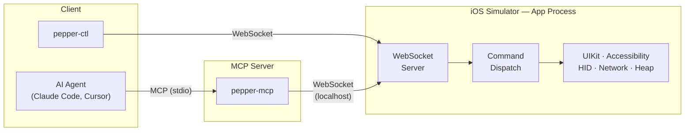

# Pepper

Pepper is an MCP server that gives AI coding assistants the ability to see, interact with, and debug iOS Simulator apps.

It works by injecting a dylib into the target app via `DYLD_INSERT_LIBRARIES`. The dylib starts a WebSocket server inside the app process. Your MCP client connects to that server and gets access to 60+ tools — everything from reading the view hierarchy to tapping buttons to intercepting network traffic.

The target app doesn't need any modifications. If it runs in the simulator, Pepper works with it.

## Quick Start

```bash
git clone https://github.com/skwallace36/Pepper.git
cd Pepper
make setup
```

Add Pepper to your MCP client (Claude Code, Cursor, etc.):

```json
{
  "mcpServers": {
    "pepper": {
      "command": "/path/to/pepper/.venv/bin/python3",
      "args": ["/path/to/pepper/tools/pepper-mcp"]
    }
  }
}
```

Try it against the included test app:

```bash
make test-deploy   # build test app, inject Pepper, launch
make ping          # verify the connection
```

Then ask your agent to `look` at the screen.

## Architecture



The MCP server (`pepper-mcp`) translates tool calls into WebSocket commands. The dylib receives them on the main thread and operates directly on UIKit — no proxies, no bridges, no out-of-process coordination.

Touch input goes through IOHIDEvent injection, which means `tap`, `scroll`, `swipe`, and `gesture` all work identically for UIKit and SwiftUI.

## Tools

**Observe** — see what's on screen

| Tool | What it does |
|---|---|
| `look` | Primary observation tool. Returns a structured map of the screen — interactive elements, labels, coordinates. |
| `screen` | Current screen name, tab, and navigation state. |
| `find` | Search for elements by text, type, or accessibility ID. |
| `tree` | Raw view hierarchy dump with configurable depth. |
| `layers` | CALayer tree inspection — borders, shadows, transforms. |
| `highlight` | Visually highlight an element on the simulator screen. |
| `read_element` | Read detailed properties of a single element. |

**Interact** — drive the app

| Tool | What it does |
|---|---|
| `tap` | Tap by text, accessibility ID, class, index, or coordinates. |
| `scroll` | Scroll to text, element, direction, or position. |
| `scroll_to` | Scroll incrementally until a target becomes visible. |
| `swipe` | Directional swipe with configurable distance and speed. |
| `gesture` | Pinch, rotate, long press, and custom multi-touch gestures. |
| `input_text` | Set text field values by accessibility ID. |
| `toggle` | Toggle switches and checkboxes. |
| `navigate` | Deep link, tab switch, or pop to a screen. |
| `back` | Go back one screen. |
| `dismiss` | Dismiss presented sheets and modals. |
| `dialog` | Detect and interact with system permission dialogs. |

**Debug** — inspect runtime state

| Tool | What it does |
|---|---|
| `vars_inspect` | Read and mutate `@State`, `@Published`, `@Observable` — any property, live. |
| `heap` | Scan the heap for instances of a class. Walk the VC hierarchy. |
| `console` | Capture app logs (print, NSLog, os_log). |
| `network` | Log, mock, simulate failures, throttle — intercepts all URLSession traffic. |
| `crash_log` | Read crash logs from the simulator. |
| `timeline` | Correlated event timeline — screen transitions, network calls, commands. |
| `animations` | Detect running animations and their properties. |
| `lifecycle` | ViewController lifecycle events. |
| `concurrency` | Inspect Swift async tasks and actors. |
| `constraints` | AutoLayout constraint dump with ambiguity detection. |
| `responder_chain` | Walk the responder chain from any element. |
| `timers` | Inspect active NSTimers and CADisplayLinks. |

**App State** — read and write persistent state

| Tool | What it does |
|---|---|
| `defaults` | Read/write UserDefaults. |
| `clipboard` | Read/write the pasteboard. |
| `keychain` | Read/write Keychain items. |
| `cookies` | Inspect HTTP cookies. |
| `storage` | Unified view of all persistence (defaults, keychain, cookies, files). |
| `sandbox` | Browse the app's file system. |
| `locale` | Query locale settings and look up localization keys. |
| `flags` | Override feature flags at runtime. |
| `push` | Inject local notifications that look like remote pushes. |
| `orientation` | Get or set device orientation. |

**Automation** — build, deploy, wait, record

| Tool | What it does |
|---|---|
| `deploy` | Build the dylib and launch the app with injection. |
| `build` | Build an Xcode project or workspace. |
| `wait_for` | Wait until an element appears on screen. |
| `wait_idle` | Wait until the app is idle (no animations, no pending network). |
| `record` | Record a screen video clip. |
| `iterate` | Re-deploy after code changes without restarting the session. |
| `snapshot` / `diff` | Capture and compare view hierarchy snapshots. |
| `screenshot` | Take a simulator screenshot. |

## Adapters

Pepper works with any app out of the box. For app-specific behavior — deep link catalogs, icon mappings, custom tab bar detection — you can write an adapter. Set `APP_ADAPTER_TYPE` and `ADAPTER_PATH` in `.env`. See `.env.example`.

## Development

```bash
make help          # list all targets
make setup         # install deps, git hooks, venv
make test-deploy   # build test app + inject Pepper
make ping          # health check
make smoke         # run smoke tests
make demo          # interactive demo walkthrough
```

Architecture guide: [`dylib/DYLIB.md`](dylib/DYLIB.md) · Tool reference: [`tools/TOOLS.md`](tools/TOOLS.md) · Troubleshooting: [`docs/TROUBLESHOOTING.md`](docs/TROUBLESHOOTING.md)
