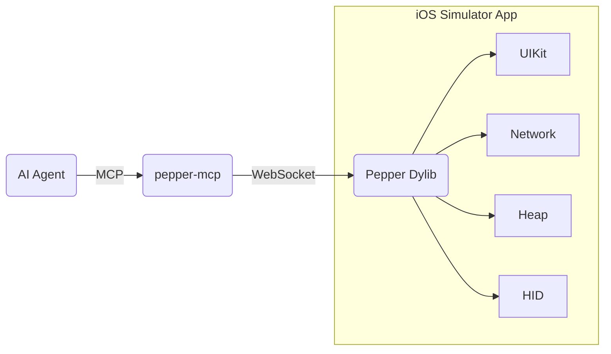

# Pepper

Pepper is an MCP server that gives AI coding assistants the ability to see, interact with, and debug iOS Simulator apps.

It works by injecting a dylib into the target app via `DYLD_INSERT_LIBRARIES`. The dylib starts a WebSocket server inside the app process. Your MCP client connects to that server and gets access to 60+ tools — everything from reading the view hierarchy to tapping buttons to intercepting network traffic.

The target app doesn't need any modifications. If it runs in the simulator, Pepper works with it.

## Quick Start

```bash
git clone https://github.com/skwallace36/Pepper.git
cd Pepper
make setup
```

Add Pepper to your MCP client (Claude Code, Cursor, etc.):

```json
{
  "mcpServers": {
    "pepper": {
      "command": "/path/to/pepper/.venv/bin/python3",
      "args": ["/path/to/pepper/tools/pepper-mcp"]
    }
  }
}
```

Try it against the included test app:

```bash
make test-deploy   # build test app, inject Pepper, launch
make ping          # verify the connection
```

Then ask your agent to `look` at the screen.

## Architecture



The MCP server translates tool calls into WebSocket commands. The dylib receives them on the main thread and operates directly on UIKit.

Touch input goes through IOHIDEvent injection — `tap`, `scroll`, `swipe`, and `gesture` work identically for UIKit and SwiftUI.

## Tools

60+ tools across five categories:

**Observe** — `look` · `screen` · `find` · `tree` · `layers` · `highlight` · `read_element`

**Interact** — `tap` · `scroll` · `scroll_to` · `swipe` · `gesture` · `input_text` · `toggle` · `navigate` · `back` · `dismiss` · `dialog`

**Debug** — `vars_inspect` · `heap` · `console` · `network` · `crash_log` · `timeline` · `animations` · `lifecycle` · `concurrency` · `constraints` · `responder_chain` · `timers`

**App State** — `defaults` · `clipboard` · `keychain` · `cookies` · `storage` · `sandbox` · `locale` · `flags` · `push` · `orientation`

**Automation** — `deploy` · `build` · `wait_for` · `wait_idle` · `record` · `iterate` · `snapshot` · `diff` · `screenshot`

Each tool has built-in documentation — your MCP client will show parameter descriptions and usage examples.

## Adapters

Pepper works with any app out of the box. For app-specific behavior — deep link catalogs, icon mappings, custom tab bar detection — you can write an adapter. Set `APP_ADAPTER_TYPE` and `ADAPTER_PATH` in `.env`. See `.env.example`.

## Development

```bash
make help          # list all targets
make setup         # install deps, git hooks, venv
make test-deploy   # build test app + inject Pepper
make ping          # health check
make smoke         # run smoke tests
make demo          # interactive demo walkthrough
```

Architecture guide: [`dylib/DYLIB.md`](dylib/DYLIB.md) · Tool reference: [`tools/TOOLS.md`](tools/TOOLS.md) · Troubleshooting: [`docs/TROUBLESHOOTING.md`](docs/TROUBLESHOOTING.md)
