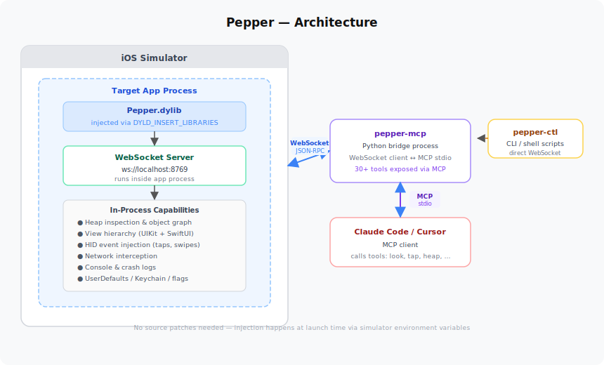

# Pepper

**MCP server for iOS engineering**

Pepper hooks into any iOS Simulator app at runtime and gives your AI real visibility and control — inspect the UI, tap buttons, read state, intercept network traffic, and more.

No SDK. No code changes. Just run your app and connect.

## Setup

Add Pepper to your MCP client config (Claude Desktop, Cursor, etc.):

```json
{
  "mcpServers": {
    "pepper": {
      "command": "/path/to/pepper/.venv/bin/python3",
      "args": ["/path/to/pepper/tools/pepper-mcp"]
    }
  }
}
```

Then point your agent at a running simulator app.

## Tools

Pepper exposes 50+ tools for working with iOS apps:

**Observe** — `look`, `screen`, `find`, `tree`, `layers`, `highlight`

**Interact** — `tap`, `scroll`, `scroll_to`, `swipe`, `gesture`, `input_text`, `toggle`, `navigate`, `back`, `dismiss`, `dialog`

**Debug** — `vars_inspect`, `heap`, `console`, `network`, `crash_log`, `timeline`, `animations`, `lifecycle`

**App State** — `defaults`, `clipboard`, `keychain`, `cookies`, `locale`, `flags`, `push`, `orientation`

**Automation** — `wait_for`, `wait_idle`, `record`, `deploy`, `build`, `iterate`

## How It Works

Pepper is injected into the simulator using `DYLD_INSERT_LIBRARIES`. It spins up a WebSocket server inside the app process, which gives direct access to:

- View hierarchy
- Runtime state
- Network layer
- Input system



```
┌─────────────────────────────────────────────────────────┐
│  AI agent / Claude Code                                 │
│    ↓  MCP tool call (look, tap, scroll, ...)            │
├─────────────────────────────────────────────────────────┤
│  pepper-mcp  (Python, stdio MCP server)                 │
│    ↓  WebSocket JSON command  ws://localhost:8770–8869  │
├─────────────────────────────────────────────────────────┤
│  Pepper dylib  (Swift, injected via DYLD_INSERT_LIBS)   │
│  ┌──────────────┐  ┌─────────────────────────────────┐  │
│  │ PepperServer │  │ PepperDispatcher                │  │
│  │ (NWListener) │→ │  ├─ UI/UX commands (50+)        │  │
│  └──────────────┘  │  ├─ Network / heap / state      │  │
│                    │  └─ Simulator control            │  │
│                    └─────────────────────────────────┘  │
│    ↓  UIKit / accessibility / IOHIDEvent APIs           │
├─────────────────────────────────────────────────────────┤
│  iOS Simulator app  (any app, unmodified)               │
└─────────────────────────────────────────────────────────┘
```

Your MCP client connects to that socket, and all commands run in-process.

No swizzling. No private API wrappers. No integration work.

If it runs in the simulator, Pepper can work with it.

### Touch Input

All interactions (tap, scroll, swipe, etc.) go through a single HID-based pipeline.

That means:

- Works the same for UIKit and SwiftUI
- No accessibility hacks
- No guessing screen coordinates

### Adapters

For app-specific behavior (deep links, custom mappings, etc.), you can add adapters.

They're optional. Without one, Pepper runs in a generic mode that works with any app.

## Development

```bash
make setup         # install deps, git hooks
make test-deploy   # build test app + inject Pepper
make ping          # verify connection
```

Run `make help` for the full list. See `CLAUDE.md` for conventions.
