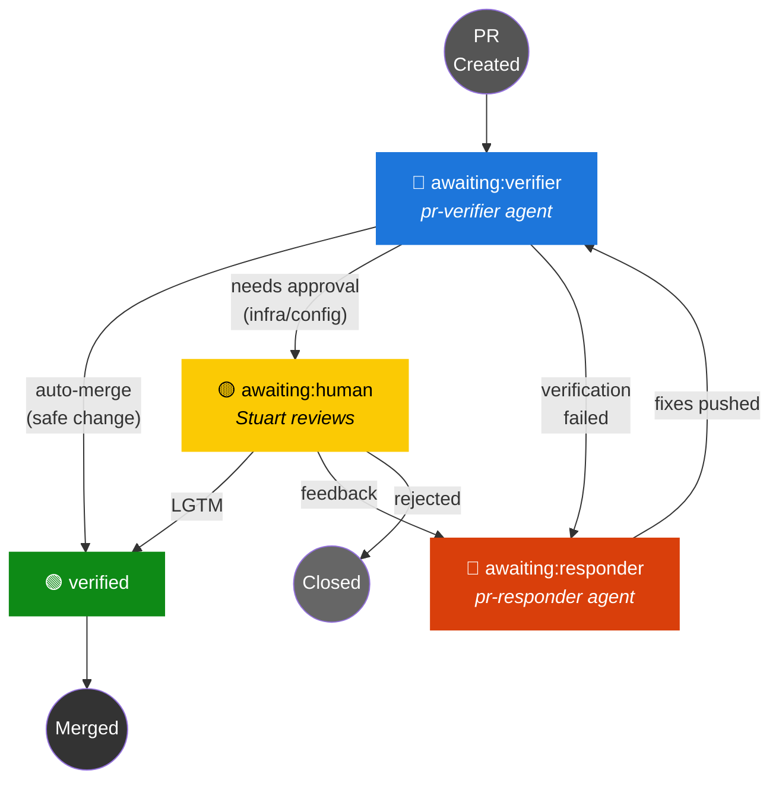

# PR State Machine

Every open PR has exactly one `awaiting:X` label indicating who needs to act next. The heartbeat reads these labels to dispatch agents.

## Rule: One Label Per PR

A PR must have exactly **one** state label at any time. Never stack labels. When transitioning, always **remove** the old label **before** adding the new one.

## States

| Label | Owner | Action |
|---|---|---|
| `awaiting:verifier` | pr-verifier agent | Build/test or code-review the PR |
| `awaiting:responder` | pr-responder agent | Address feedback and push fixes |
| `awaiting:human` | Human (Stuart) | Review and approve/reject |
| `verified` | Auto-merge or human | Terminal — PR is merged |
| *(no label)* | Heartbeat | Classify and assign initial label |

## State Diagram

> **Conflict-resolver** operates orthogonally — rebases any PR with merge conflicts, regardless of `awaiting:` label.
>
> **Heartbeat** auto-closes PRs with merge conflicts >24h old.

## Transitions

| From | To | Trigger | Who |
|---|---|---|---|
| *(new PR)* | `awaiting:verifier` | `classify-pr.sh` after PR creation | agent-runner |
| `awaiting:verifier` | `verified` → merge | Verification passes, safe to merge | pr-verifier |
| `awaiting:verifier` | `awaiting:human` | Verified but touches infra/config | pr-verifier |
| `awaiting:verifier` | `awaiting:responder` | Verification failed | pr-verifier |
| `awaiting:human` | `verified` → merge | Human comments LGTM | heartbeat |
| `awaiting:human` | `awaiting:responder` | Human leaves feedback | heartbeat |
| `awaiting:human` | *(closed)* | Human rejects | human |
| `awaiting:responder` | `awaiting:verifier` | Responder pushes fixes | pr-responder |

## Agent Responsibilities

### PR-linked agents (driven by labels)

| Agent | Trigger | Input | Output |
|---|---|---|---|
| **pr-verifier** | `awaiting:verifier` | PR diff | `verified` or `awaiting:human` or `awaiting:responder` |
| **pr-responder** | `awaiting:responder` | Feedback comments | Code fixes → `awaiting:verifier` |
| **conflict-resolver** | Any PR with `CONFLICTING` mergeable status | Merge conflict | Rebased branch |

### Work-creation agents (driven by issues)

| Agent | Trigger | Input | Output |
|---|---|---|---|
| **builder** | Open issues with `area:*` labels | Issue description | Branch + PR (labeled `awaiting:verifier`) |
| **bugfix** | Open issues with `bug` label | Bug report | Branch + PR (labeled `awaiting:verifier`) |

### Support agents (scheduled/on-demand)

| Agent | Trigger | Input | Output |
|---|---|---|---|
| **tester** | Open issues with `area:test-coverage` | Coverage gaps | Test results + PR |
| **groomer** | Twice daily (heartbeat) | Issue backlog | Priority labels, stale cleanup |
| **researcher** | Manual or heartbeat | Research backlog | Findings in RESEARCH.md |

## Verification Fast Path

The verifier determines HOW to verify from the diff, not from labels:

- **Swift/ObjC in `dylib/` or `test-app/`** → full build + simulator deploy + live testing (~3-5 min)
- **Everything else** (docs, scripts, Python, config) → code review only (~30s)

## LGTM Auto-Merge

When the heartbeat detects a human LGTM comment on any `awaiting:` PR:
1. Remove all `awaiting:*` labels
2. Add `verified`
3. Squash-merge and delete branch

## Chaining

When a builder/bugfix agent finishes:
1. `agent-runner.sh` classifies any new unlabeled PRs → `awaiting:verifier`
2. If no pr-verifier is running and `awaiting:verifier` PRs exist, chains a pr-verifier immediately

## Gaps & Future Work

1. **Issue state machine** — extend `awaiting:X` pattern to issues, not just PRs. `awaiting:builder`, `awaiting:researcher`, etc.

2. **Smart labeling agent** — an agent that reviews the deterministic classification and overrides when context matters (e.g., "this Python change affects deploy behavior, needs sim test").

3. **Parallel verification** — some PRs are independent and could be verified concurrently on different sims. Currently sequential per sim.
