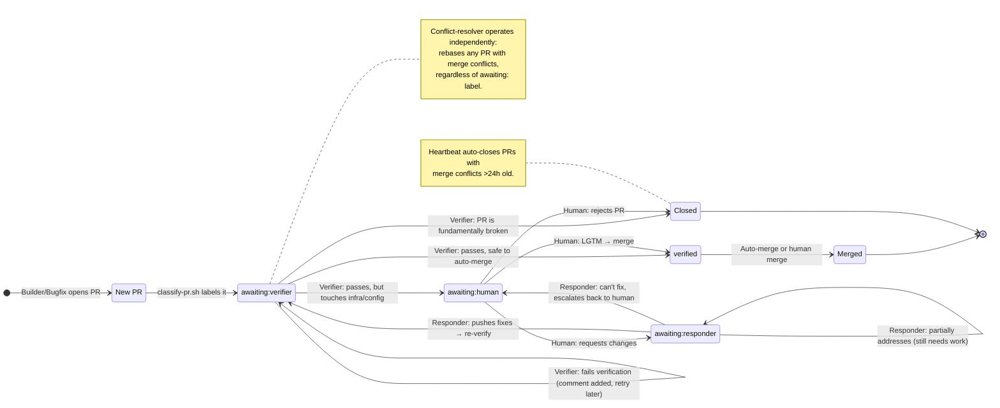

# PR State Machine

Every open PR has exactly one `awaiting:X` label indicating who needs to act next. The heartbeat reads these labels to dispatch agents.

## States

| Label | Owner | Action |
|---|---|---|
| `awaiting:verifier` | pr-verifier agent | Build/test or code-review the PR |
| `awaiting:responder` | pr-responder agent | Address human feedback on the PR |
| `awaiting:human` | Human (Stuart) | Review and approve/reject |
| `verified` | Auto-merge or human | Terminal — PR is ready to merge |
| *(no label)* | Heartbeat | Classify and assign initial label |

## State Diagram

## Agent Responsibilities

### PR-linked agents (driven by labels)

| Agent | Trigger | Input | Output |
|---|---|---|---|
| **pr-verifier** | `awaiting:verifier` | PR diff | `verified` or `awaiting:human` or failure comment |
| **pr-responder** | `awaiting:responder` | Human comment | Code changes → `awaiting:verifier` |
| **conflict-resolver** | Any PR with `CONFLICTING` mergeable status | Merge conflict | Rebased branch |

### Work-creation agents (driven by issues)

| Agent | Trigger | Input | Output |
|---|---|---|---|
| **builder** | Open issues with `area:*` labels | Issue description | Branch + PR (labeled `awaiting:verifier`) |
| **bugfix** | Open issues with `bug` label | Bug report | Branch + PR (labeled `awaiting:verifier`) |

### Support agents (scheduled/on-demand)

| Agent | Trigger | Input | Output |
|---|---|---|---|
| **tester** | Open issues with `area:test-coverage` | Coverage gaps | Test results + PR |
| **groomer** | Twice daily (heartbeat) | Issue backlog | Priority labels, stale cleanup |
| **researcher** | Manual or heartbeat | Research backlog | Findings in RESEARCH.md |

## Verification Fast Path

The verifier determines HOW to verify from the diff, not from labels:

- **Swift/ObjC in `dylib/` or `test-app/`** → full build + simulator deploy + live testing (~3-5 min)
- **Everything else** (docs, scripts, Python, config) → code review only (~30s)

## Gaps & Future Work

1. **Failed verification loop** — when verification fails, the PR sits with no label. Nobody auto-fixes it. Could add `awaiting:builder` to send it back for repairs.

2. **Tester integration** — tester agent works on coverage issues, not PRs. Could label PRs that add new commands with `awaiting:tester` for coverage validation.

3. **Smart labeling agent** — an agent that reviews the deterministic classification and overrides when context matters (e.g., "this Python change affects deploy behavior, needs sim test").

4. **Issue state machine** — extend `awaiting:X` pattern to issues, not just PRs. `awaiting:builder`, `awaiting:researcher`, etc.

5. **Parallel verification** — some PRs are independent and could be verified concurrently on different sims. Currently sequential per sim.
